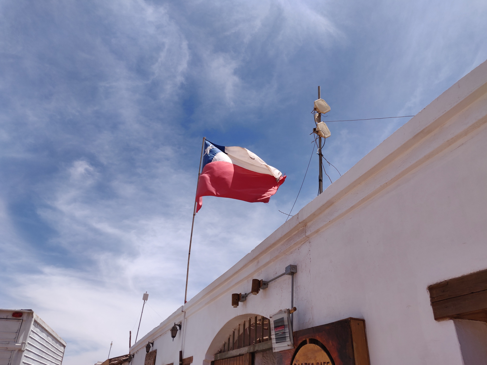
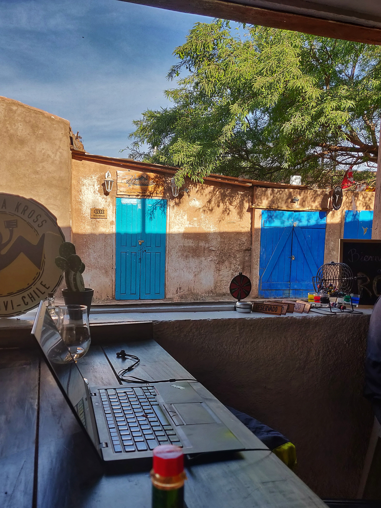
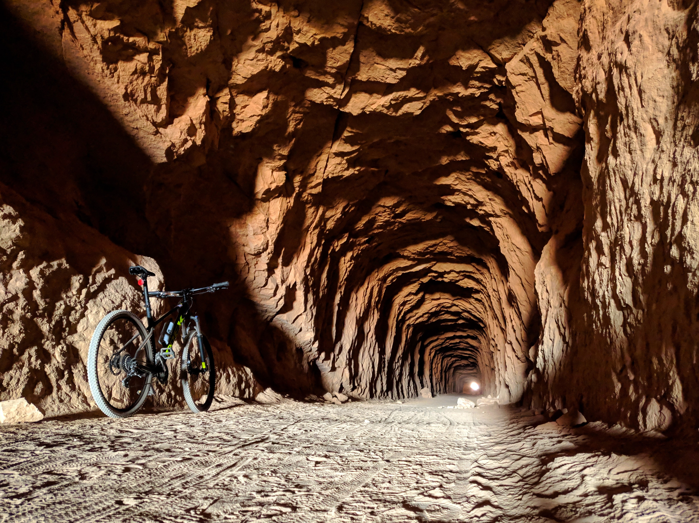

_ThinkPad X1 Carbon probably 1 hour after being last cleaned_

I recently spent 22 days in **San Pedro de Atacama**, a tiny town in the middle of the **Atacama desert, the driest place on Earth**. I’ve been hanging around in **Chile** for a while and I felt that I had to visit this place before leaving the country.

Despite heading there during the end of the year holidays, I was in a regular work routine and I had a few things to sort out on some personal projects, so I headed there expecting to keep myself active.

I thought that my biggest trouble would be the dust covering my devices, but I also faced some other interesting challenges. In the first days, I started to question myself if it was really a good idea to go there while working. But I held tightly and accepted those challenges.

## Infrastructure

This was probably the most intimidating aspect for me but ended up being pretty manageable.

**There is little to no broadband internet** infrastructure. Most places have wifi, but as deep as I looked, **all of them runs on mobile data at the end**. I was totally not aware of this and just noticed after arriving. It kind of scared me at first, especially because the connection in the hostel I stayed in was painfully bad.

After a few days digging around, I found a cafe on [workfrom](https://workfrom.co/) that had better than average wifi. Soon I noticed that it had a special setup: **dedicated mobile data antennas** outside that looks a lot more reliable than the small 4G dongles that I found in other venues:

It was better, but not enough. I still suffered from some stability drops when the cafe was full and also with the high cafe prices. So I soon realized it would be just better to **use my phone as a 4G hotspot**. So I just rolled with that, and it ended up working really well, and cheap: ~7 USD for 10GB, which for me lasted on average 1 week.

Still, I would go out to cafes a few times a week to try different work environments. Some are very nice and unique.

## Atmosphere

The air is very dry, so my nose — and everyone else’s — was irritated the whole time, and blowing your nose turns into a morning ritual. I think blowing/cleaning your nose must be more socially accepted there because you just can’t avoid it. I got surprised on an almost daily basis on what came out of it 😂

It can get very hot during the day, and you must also be worried about protecting yourself from sunlight.

Apart from those aspects, the place is just wonderful. It’s hard to describe, it feels like a magical place. It was one of the few places that I was kind of sorry about leaving.

> It is said that the high quantities of quartz and copper in the region gives its people positive energy, and the good vibes of northern Chile’s number-one tourist draw, San Pedro de Atacama, are sky high. — [Lonely Planet](https://www.lonelyplanet.com/chile/northern-chile/san-pedro-de-atacama)

Talking about energy, well, I felt like I had **lots of energy the whole time**. I was able to get a lot of stuff done, even with the not so ideal infrastructure and uncomfortable climate. In fact, I slept very little in the first weeks because it felt like working, buying food, walking around and talking to people was not enough to spend all the energy.

## Tourism

The tours can be very relaxing and renovating. I was able to visit some amazing places that feel like a masterpiece from nature.

º](./images/laguna.jpeg)_[View in 360º](https://photos.app.goo.gl/FMx4TQWLfHmXu6Sj6)_

It was also nice to bike through some interesting places:

**But I was also terrified of how tourism is so prevalent there**. Everyone that I met was there either:

- to do tours

- to work with tours or tourism-related stuff

At first, I felt that I was in the wrong party because all the people were there just for tours, while I was also interested in that but mostly working with non-tourism stuff and trying to live as I would in any place.

Almost every conversation started with “what have you done today?” which means “which tours have you done?”, but all I had to answer was something like “I ate lots of grapes, read one chapter of [\*Prometheus Rising](https://www.goodreads.com/book/show/28597.Prometheus_Rising)\* in the morning and implemented pagination in some areas of our web application”.

Some people had every day of their trips booked with tours. In the first days, I started to feel anxious. A feeling that I was missing something for not doing what everyone was doing—fear of missing out. But soon I realized that most of those people were on vacation, and were seriously invested in those days that they are able to travel. Different purposes, different expectations.

It’s interesting though how the place runs mostly on tourism. I heard stories about how a few decades ago there was almost nothing there (besides the desert of course) and there was a lot of scarcity and poverty. Probably because it was not so cheap to travel and information was not so readily available — i.e. people were not posting photos of the place on Instagram and writing blog posts like this one. Today it has all the basic stuff —water, electricity, internet, minimarkets — , a small but vibrant economy and lots of opportunities for people wanting to make some extra money during the high season.

It was nice to see how remote work is possible even in isolated and hostile places like this one.

All in all, it was a great experience that made me feel stronger. Now I would think twice before going to a rustic place like this while working but at the same time, I would also be more prepared to do the same thing if I wanted to.
